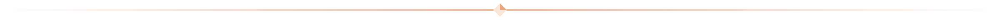

    

### About me

I'm a second year software development student working on improving my knowledge and skills in C++ and C#.

### Projects

- Healthcare System
- Starrboard
- Happy Aquarium Remake
- Personal tools

### Tech

**Languages**

    
    
    
    
    
    
    

**Stack**

    
    

**Tools**

    
    
    

**Engines**

    
    

### Currently

Working on a budgeting app and my first web game.
